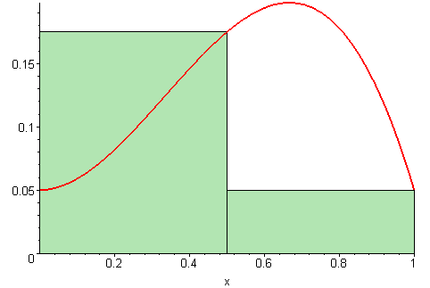

## Numerical Integration

In physics and many applied sciences, computing integrals is essential for modeling real-world phenomena. Whether it is to evaluate physical quantities such as energy, probability distributions, or statistical expectations, integration appears in many contexts. However many integrals cannot be solved analytically, requiring **numerical methods** for their evaluation.

For example, we often need to compute the integral of a function \\(f(x)\\) over an interval\([a,b]\):

$$I=\int_a^b f(x)\,dx.$$

---

### From Continuous to Discrete

By definition, the **definite integral** of a continuous function \(f \)over the interval \([a, b] \), denoted as:

$$I = \int_a^b f(x)\,dx,$$

is the **limit of a Riemann sum** as the number of subdivisions \(n \)approaches infinity:

$$\int_{a}^{b} f(x)dx = \lim_{n \to \infty} \sum_{i=1}^{n} f(x_i) \Delta x,$$

where \(\Delta x = \frac{b-a}{n} \)and \(x_i = a + i \cdot \Delta x \)(left point approximation).

As we increase the number of subdivisions \(n \), the Riemann sum becomes a better approximation of the integral. This can be visualized in the following animation:

  

Each rectangle has an area of \(f(x_i) \Delta x \)and is chosen regularly, meaning that the points \(x_i \)are equally spaced.

### Equivalence with Uniform Sampling

In the **Riemann sum** integration method, and other classical methods, the entire interval \([a, b] \)is represented equally. Similarly, instead of summing over regularly spaced points, we could choose a **random variable** \(X \)following a **uniform probability density function** over \([a, b] \), given by:

$$p(x) = \frac{1}{b-a}, \quad x \in [a, b].$$

Rewriting the Riemann sum using this random variable, we obtain the following approximation:

$$I \approx (b-a) \cdot \frac{1}{N} \sum_{i=1}^{N} f(X_i),$$

where \(X_i \sim \mathcal{U}(a, b) \)are \(N \)independent and identically distributed (i.i.d.) random samples.

> The key observation here is that the order of summation does not matter, as long as all parts of the interval are represented equally. We expect to obtain the same integral estimation choosing the \(x_i \)from an uniform distribution as the Riemann sum for a sufficiently large number of points.

This formulation forms the basis of the **Monte Carlo integration method**, where instead of using a regular grid, we estimate the integral by taking random samples.

> **Monte Carlo methods are techniques that use random sampling and probability statistics to solve problems, particularly those involving integration and optimization.**

### Alternative Numerical Methods

Several classical numerical methods exist to approximate the value of an integral.

- One such method is the **trapezoidal rule**, which approximates the integral as:
     $$I \approx \frac{\Delta x}{2} \sum_{i=0}^{N-1} (f(x_i) + f(x_{i+1}))$$

 - Another common approach is **Simpson’s rule**, which provides a higher-order approximation using parabolic interpolation:
    $$I\approx\frac{\Delta x}{3}\sum_{i=0}^{N/2}f(x_{2i})+4f(x_{2i+1})+f(x_{2i+2})$$

For a one dimension integral, those two methode have a convergence rates proportionnal to \(\propto(1/N^{2}) \)for the trapezoidale method and \(\propto(1/N^{4}) \)for the simpson one.

However for a **$d$-dimensional integral** their convergence rates decrease as \( \propto(1/N^{2/d}) \) for the trapedoidale method and \(\propto(1/N^{4/d}) \)for the simpsons one.

As \(d \)increases, these deterministic methods become inefficient due to the **curse of dimensionality**.

### Monte Carlo Integration

An alternative approach is **Monte Carlo integration**, which relies on random sampling rather than a structured grid.

The key advantage of Monte Carlo methods is that their convergence rate is **independent of dimension** and proportionnal to \(\propto(1/\sqrt{N}) \)

For a **4d integral**, Monte Carlo converges as fast as the trapezoidal rule. For an **8d integral**, it converges as fast as Simpson’s rule. And for higher dimensions, Monte Carlo becomes significantly more efficient.

We previously considered Monte Carlo integration using a uniform distribution, but we can generalize this idea by using any probability density function (PDF).
Consider then a random variable \(X \)with probability density function \(p(x) \), the transfer theorem gives:
$\mathbb{E}(f(X)) = \int_a^b f(x) p(x) \, \mathrm{d}x.$

About Transfer Theorem

> The transfer theorem is a fundamental theorem in probability theory that allows us to express the expectation of a function of a random variable \(X \)as an integral against the law of \(X \). Its general form is as follows:

> **Theorem:** Let \((\Omega, \mathcal{B}, \mathbb{P}) \)be a probability space and let \(X: (\Omega, \mathcal{A}, \mathbb{P}) \to \mathbb{R} \)be a random variable whose law is denoted by \(\mathbb{P}_X \). Then:
> 1. For any measurable function \(\varphi: \mathbb{R} \to \mathbb{R}_+ \), we have:
    \(\int_{\Omega} \varphi(X(\omega)) \, \mathrm{d}\mathbb{P}(\omega) = \int_{\mathbb{R}} \varphi(x) \, \mathrm{d}\mathbb{P}_X(x) \)

If our goal is to compute the integral of \(f(x) \), we can rewrite it as

$$I = \int_a^b f(x) \, dx = \int_a^b \frac{f(x)}{p(x)} \, p(x) \, dx = \mathbb{E}\left[\frac{f(X)}{p(X)}\right] $$

From the Law of large number we get that 
$$\mathbb{E} \left( \frac{f(X)}{p(X)} \right) =\int_a^b \frac{f(x)}{p(x)} p(x) dx \approx \frac{1}{N} \sum_{i=1}^{N} \frac{f(x_i)}{p(x_i)} = I_N $$

About Law of Large Number

> The law of Large number  tells us that if we take a sequence of independent and identically distributed (i.i.d) random variables \(X_i \)with an expectation \(\mathbb{E}[X] \), then the empirical mean converges almost surely to the expectation:
> $$\frac{1}{N} \sum_{i=1}^{N} X_i \quad \xrightarrow{N \to \infty} \quad \mathbb{E}[X]$$

Ok but now, how do you choose your pdf ? Well, we will see that the choice of the pdf is really important in regards of the uncertainties for the estimated integral value.

### Chose of pdf and Unvertainties 

The Central Limit Theorem (CLT) tells us that for sufficiently large \(N \), the distribution of \(I_N \)is approximately normal:

$$I_N \approx \mathcal{N} \left( I, \frac{\sigma^2}{N} \right)$$
with $$\sigma^2 = \mathbb{V} \left[ \frac{f(X)}{p(X)} \right]$$

About central limit

> The Central Limit Theorem states that, given a sufficiently large sample size, the distribution of the sample mean of i.i.d. random variables approaches a normal distribution, regardless of  the original distribution of the variables.

**The choice of the pdf \(p(x) \)directly influences $\sigma^2 \)and, consequently, the uncertainty in the estimated integral.**
By selecting an appropriate PDF, we can significantly improve the accuracy and efficiency of Monte Carlo integration.

Rest on another page